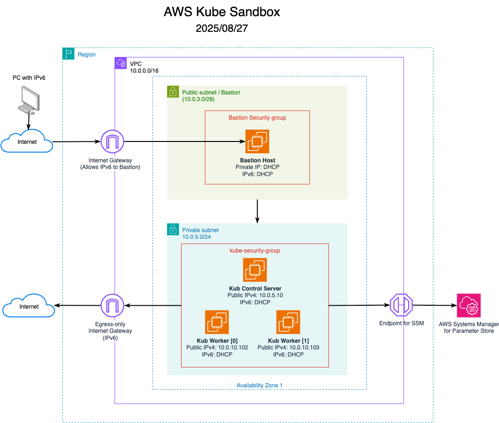

# Kubernetes Sandbox

A simplified, **non-production** Kubernetes cluster designed to:

* Explore how Kubernetes works under the hood.
* Automate cluster deployment with minimal manual steps.
* Keep costs low while testing infrastructure automation tools.

Once the images are built and stored in AWS, a new cluster can be deployed in just a few minutes (see [Timing](#timing)).

Reference material used to guide automation design:

* [Install Kubernetes on Ubuntu – phoenixNAP](https://phoenixnap.com/kb/install-kubernetes-on-ubuntu)
* [Install Kubernetes on Ubuntu – Cherry Servers](https://www.cherryservers.com/blog/install-kubernetes-ubuntu)

---

## About `aws-kube` Development Sandbox

This is a [development sandbox](https://en.wikipedia.org/wiki/Sandbox_%28software_development%29) for building and testing a **lightweight Kubernetes cluster** in AWS using AMI images and essential tooling only.

**Core technologies:**

* **Vagrant** – Test images locally before deploying to AWS.
* **Ansible** – Automate software installation and image configuration.
* **Packer** – Build AWS AMI images.
* **Terraform** – Provision and manage AWS infrastructure.

**Goals:**

* Create a **repeatable** process for deploying a Kubernetes environment.
* Gain hands-on experience with Kubernetes infrastructure automation.
* Spin clusters up and tear them down quickly to reduce costs.

**Planned enhancements:**

* Add a CI/CD pipeline to deploy sample applications to Kubernetes.

---

## Features

* **Kubernetes Cluster:**

  * Fully functional Kubernetes environment to experiment with.

* **AWS:**

  * Hands-on experience deploying infrastructure in AWS using platform engineering tools.

* **Terraform:**

  * Automates VPC creation and cluster deployment.
  * Uses **two separate VPCs**:

    * One for building AMIs with Packer.
    * One for deploying the Kubernetes cluster.

* **Vagrant:**

  * Local testing of image builds before pushing to AWS.

* **Packer:**

  * Builds reusable AMI images.

* **Ansible:**

  * Installs packages, manages configuration, and prepares images.

* **IPv6 Support:**

  * Practice working in IPv6-enabled environments.

---

## Project Structure

Four main directories, each with its own `README` for instructions.
Follow these steps in order:

| Step | Directory                 | Purpose                                              |
| ---- | ------------------------- | ---------------------------------------------------- |
| 1    | `aws-kube-shared`         | Shared variables for Packer and Ansible              |
| 2    | `aws-kube-ansible-builds` | Test Ansible code locally with Vagrant               |
| 3    | `aws-kube-tf-packer`      | Create a temporary AWS VPC for AMI builds            |
| 4    | `aws-kube-ansible-builds` | Build AWS AMIs using Packer                          |
| 5    | `aws-kube-tf-packer`      | Destroy the AMI build VPC                            |
| 6    | `aws-kube-tf-kubernetes`  | Deploy the Kubernetes cluster VPC and infrastructure |

**Next Steps:**

* SSH into the Bastion Host.
* SSH into the Kubernetes Controller.
* Experiment and break things—this environment is designed to be disposable.

---

## Setup Instructions

1. **Ensure IPv6 access**

   * Confirm your workstation has a **public IPv6 address**.
   * See [About IPv6](#about-ipv6-in-this-environment) for details.

2. **Add your SSH key**

   * Save your public key to `~/.ssh/id_rsa.pub`.
   * This key is baked into the AMIs for authentication.

3. **Configure AWS credentials**

   * Save credentials in `~/.aws/credentials`:

     ```ini
     [default]
     aws_access_key_id=<your AWS access key>
     aws_secret_access_key=<your AWS secret key>
     ```

---

## Scope

**In-Scope:**

* 1 Kubernetes Controller
* 2+ Kubernetes Workers
* Local testing with Vagrant
* AMI builds for repeatable deployments
  * AMIs remain in AWS even after VPC teardown.
* Bastion host access for all AWS instances

**Out-of-Scope:**

* Redundancy or HA configurations
* In-depth Kubernetes usage guides

---

## Prerequisites & Versions

Building AMIs ensures **repeatable environments** and prevents dependency breakage (e.g., moved Calico files to the repo).

Exact versions tested:

| Component            | Version                                  |
| -------------------- | ---------------------------------------- |
| Vagrant              | 2.4.9                                    |
| Ansible              | 2.18.8                                   |
| Packer               | 1.86                                     |
| Packer Amazon Plugin | 0.0.2                                    |
| Terraform            | 1.12.2                                   |
| Vagrant Image        | `ubuntu/noble`                         |
| AWS Image            | `ubuntu-noble-24.04-amd64-server-*`      |
| Kubernetes Packages  | kubeadm=1.33, kubelet=1.33, kubectl=1.33 |

---

## Costs and Timing

### Timing

Initial environment setup (tool installation, credentials) is the most time-consuming step. Once set up:

| Process                        | Time to Build    | Time to Destroy |
| ------------------------------ | ---------------- | --------------- |
| Vagrant test builds (2 images) | \~3:30 min       | \~0:09 min      |
| Packer VPC creation & teardown | \~2:30 min       | \~1:00 min      |
| Build 2 AMIs in Packer VPC     | \~10:00 min each | N/A             |
| Kubernetes VPC & cluster       | \~4:00 min       | \~4:00 min      |

After AMIs are built, only the **Kubernetes VPC & cluster** need to be created/destroyed.

---

### Costs

* Total monthly AWS cost (building environments ~~10 times): \*\*~~\$5 USD\*\*
* AMI storage and prolonged runtime not included
* Best practice: **destroy VPCs when idle** to minimize costs

**Cost-saving tips:**

* Deregister AMIs **and** delete their snapshots manually.
* Always tear down environments when not in use.

---

## IPv6 in This Environment

If your ISP provides **native IPv6**, you’re good to go.

**Check IPv6:**

```bash
curl -S ipv6.icanhazip.com
```

or visit: [http://ipv6.icanhazip.com](http://ipv6.icanhazip.com)

Terraform retrieves your IPv6 address automatically to restrict Bastion Host access.

---

### No IPv6 from ISP?

* Use a VPN with IPv6 support.
* Examples (not endorsements):

  * [hide.me](https://hide.me)
  * [Perfect Privacy](https://www.perfect-privacy.com)
  * [airvpn.org](https://airvpn.org)

> Note: Some VPN apps (e.g., Perfect Privacy) may require native OS VPN setups (e.g., macOS IKEv2) to obtain IPv6.

---

### Need IPv4?

Terraform code has IPv4 scaffolding.

* Comment out `ingress_ip_v6` references to switch to IPv4.

---

### IPv6 Backstory

This setup doubled as an IPv6 learning project:

* Original ISP (Xfinity) used NAT’d IPv6.
* Switched to an ISP without IPv6 support and used VPNs to continue testing.
* Avoided paying for a NAT Gateway by leveraging IPv6.

---

## Reference Diagram



---

## Future Enhancements

* Replace Calico with AWS VPC CNI.
* Consolidate Packer, Vagrant, and Ansible configs into single files.
* Create task-specific shell wrappers for each tool.
* Explore having Packer handle Vagrant builds.

---

